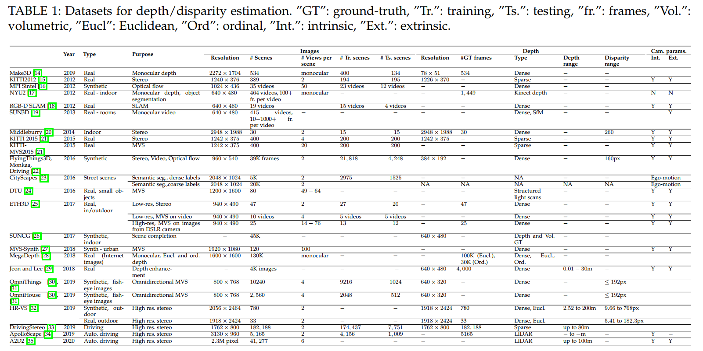
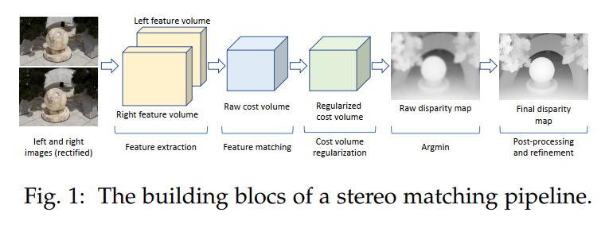
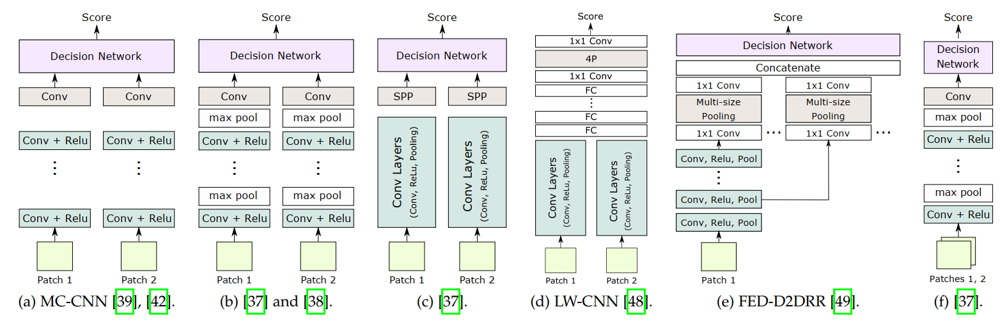
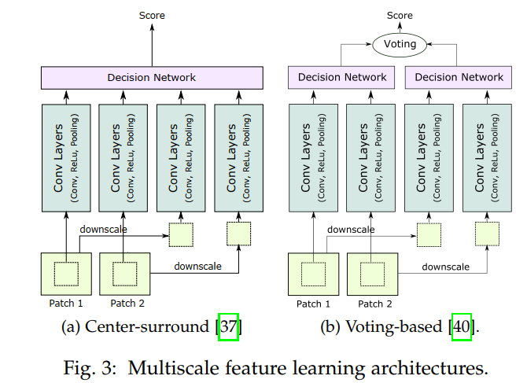

# A Survey on Deep Learning Techniques for Stereo-based Depth Estimation

## 1.INTRODUCTION

1.第一代方法是匹配图片间的像素，这些图片是由精确标定好的相机拍摄的。这种方法对弱纹理，遮挡，重复纹理等区域的处理效果不好。

2.人类看一个物体除了视觉上真正看到的，还有一些先验知识来辅助感知这个物体。第二代方法试图将问题转化为学习任务来利用这些先验知识。

3.第三代方法是利用了深度学习技术及大型数据集。

## 2.SCOPE AND TAXONOMY

文章只讨论双目立体匹配和多目立体匹配（Multi-View Stereo），对于单目的重建和基于视频的重建并不在这篇综述的讨论范围内。

---

重建的方法分为了两类：

第一类是模拟传统的立体匹配方法显示地学习，包括特征提取、特征匹配和代价聚合、视差估计这这步骤，分别独立来做。

第二类是端到端的网络直接获取视差图。早期的方法把视差估计视为一个回归问题，这种方法快速简单但是需要大量数据集的支撑。第二种是根据传统方法的步骤，把端到端的网络分为几个阶段，每个阶段分别解决不同的问题。

## 3.DATASETS

## 4.DEPTH BY STEREO MATCHING

一般的，双目重建的核心思路是使下面的能量函数最小，其中第一项为匹配代价；第二项为一个正则项用来施加约束，如平滑、左右一致性约束等。

分为四个步骤,特征提取、特征匹配、视差计算、视差后处理。前两步构造代价空间。第三步正则化代价空间，然后通过最小化能量函数得到初步的视差图。最后一步是对得到的视差图进行优化和后处理。

### 4.1Learning feature extraction and matching

深度学习的出现后，我们就不用去人工指定特征了，如之前的AD或者Census都是人为指定的特征，现在神经网络可以自己去学习特征。左图在 `x=(i,j)`为中心的域与右图以 `y=(i,j-d)`为中心的（其中d大于最小视差小于最大视差）相匹配，通过标准相似性度量得到代价值 `C(x,d)`。

#### 4.1.1 The basic network architecture

最基础的结构：由两个编码结构组成，一边输入的是左目图像的某个像素 `x=(i,j)`及其周围的信息，另一边是右目图像想对应的 `y=(i,j-d)`的信息，通过网络去找特征。上图的(b)多加了maxpooling，可以使其获取到更大范围内的信息。（c）多了一层Spatial Pyramid Pooling,它使输出的特征网格独立于输入的图像大小。最后由全链接层来判断特征的相似程度。相较于传统的非深度学习的方法，特征与判断的方法不用人为指定，而是由网络学习获得。视差图的效果会好很多，当然也会慢一些。

#### 4.1.2 Network architecture variants

1. 使用ResNet优化网络，加深网络的深度以提高效果；
2. 扩大感受野，使用膨胀（空洞）卷积，加入SPP空间金字塔结构；
3. 学习多尺度的特征，如上图所示，分为两个部分，第一个部分成为central high-resolution stream，另一部分称为surround low-resolution stream。在不同尺度上学习，在顶层进行整合。
4. 减小向前传递次数，一般的左图的一个像素在右图需要找n个可能匹配的地方（n为可能的视差范围），需要计算的量比较大，现在左图找一块匹配区域，右图找一块更大的区域（涵盖了所有可能的点），再输入网络会有效减少向前传递的次数。
5. 通过学习相似性，而不是学习特征，来简化网络。如（f），把左右图像打包。

#### 4.1.3 Training procedures

1.supervised training:手工制作匹配块，有positive匹配和negative匹配块，使用这些数据集训练神经网络，使损失函数最小化，这里的代价是指真实的视差与预测视差的差异性大小。可以使用$L_{1}$距离，铰链损失函数或交叉熵损失函数。

2.weakly supervised learning：没看懂
