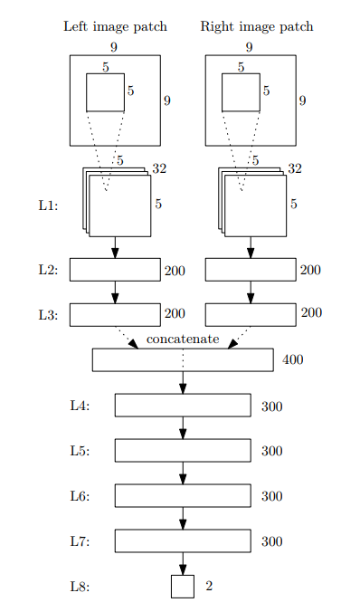
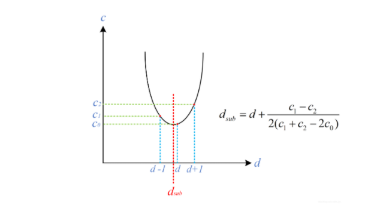

# Computing the Stereo Matching Cost with a Convolutional Neural Network

## Abstract

相对于传统方法，这里训练了一个神经网络来求匹配代价。神经网络可以衡量两个校正后的匹配块间的相似程度。求出代价后利用半全局匹配和左右一致性检查来优化结果。

## 1.Introduction

介绍了下传统的方法,除了代价是用神经网络求的以外，后面的步骤跟SGM传统算法没区别。

本文贡献：1.将神经网络运用到了立体匹配中。

2.当时的效果很好。

## 2.Related work

~

## 3.Computing the matching cost

介绍了下传统方法AD的原理，就是以灰度值大小来衡量两个匹配区域的相似程度。所以作者想到了用监督学习的方式来训练一个神经网络，用来估计两个区域的匹配程度。

### 3.1.Creating the dataset

左图中的以`p(x,y)`为中心的nxn的匹配快，在右图中找一个positive一个negative的匹配块。他们的中心分别为：$q_{neg}=(x-d+o_{neg},y)$其中$o_{neg}$是从集合$\{-N_{hi},...,-N_{lo},N_{lo},...,N_{hi}\}$中任意选出的；$q_{pos}=(x-d+o_{pos},y)$其中$o_{pos}$是从集合$\{-P_{hi},...,P_{hi}\}$中任意选出的。

d是已知视差，$N_{hi} N_{lo} P_{hi}$和匹配快的边长n都是超参数。

### 3.2 Network architecture

总共有L1到L8共8层网络，其中第一层是卷积神经网络，其他的都是全连接层。每一层的卷积核大小跟全连接层的大小由上图所示。其中第八层结果作softmax函数的输入，生成在好匹配和坏匹配的上的分布。前三层左右的权重是一样的；除了最后一层，其他层中间都有ReLU激活函数。如果想改成处理RGB图像的话，卷积核变为三通道就行了。

### 3.3.Matching cost

匹配代价$C_{cnn}(p,d)$是网络的输出：

可以比较节省时间的做法：

1.对于一个位置p前三层只用前向传递一次就行了。

2.通过向网络提供全分辨率图像进行传递而非9 × 9 图像块，可以计算出一次正向传播中所有位置的L3层输出。为了实现这一点，我们将L2层和L3层卷积，在L2层中使用尺寸为5×5×32的滤波器，在L3层中使用尺寸为1 × 1 × 200的滤波器，两者都输出200个特征映射。

3.同样，可以使用尺寸为1 × 1 的滤波器替换L4到L8，以计算单个正向传播中所有位置的输出。

## 4.Stereo method

### 4.1. Cross-based cost aggregation

用方形的区域，相当于做了一个错误的假设：匹配块中的视差是连续的。所以效果不好，这里采取了一种自适应为每个像素选择邻域的方法：

[参考文献](https://core.ac.uk/download/pdf/207747318.pdf)

[我的笔记](https://github.com/xiaoye2020/Stereo-Matching-Paper/blob/master/06Cross-Based%20Local%20Stereo%20Matching%20Using%20Orthogonal%20Integral%20Images.md)

### 4.2. Semiglobal matching

采用半全局匹配的方法：

[参考文献](http://openrs.whu.edu.cn/photogrammetry/2015/SGM%202008%20PAMI%20-%20Stereo%20Processing%20by%20Semiglobal%20Matching%20and%20Mutual%20Informtion.pdf)

[我的笔记](https://github.com/xiaoye2020/Stereo-Matching-Paper/blob/master/04Stereo%20Processing%20by%20SemiglobalMatching%20and%20Mutual%20Information.md)

### 4.3. Computing the disparity image

winner take all ：

#### 4.3.1 Interpolation

通过左右一致性检查等方法找到一些视差无效区域：第一种是遮挡区，即由于前景遮挡在左视图上可以看到但是在右视图上不可看到的区域；第二种是误匹配区，即处在非遮挡区域但是也匹配错误的区域。

对于遮挡区插值的策略是用背景的有效视差填充，可以在水平方向上找第一个最小的值（离得远的视差越小）。

对于误匹配区域适合用周围的视差进行填充，论文中是用的16方向的视差值的中值。

#### 4.3.2 Subpixel enhancement

#### 4.3.3 Refinement

把视差图还原到输入图像的大小。

## 5.Experimental resulte

使用随机梯度下降SGD，交叉熵损失函数（cross-entropy loss）。批处理大小设置为128。训练了16轮，学习率最初设置为0.01，并在12次和15次迭代中减少至十分之一。在进行学习之前，打乱训练集。从194个训练图像对中，我们提取了4500万样本。一半属于正类，一半属于负类。对每幅图像进行了预处理，减去平均值，再除以其像素强度值的标准差。
