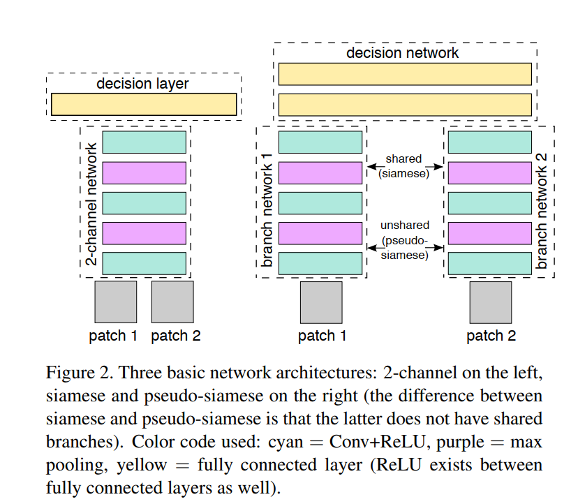
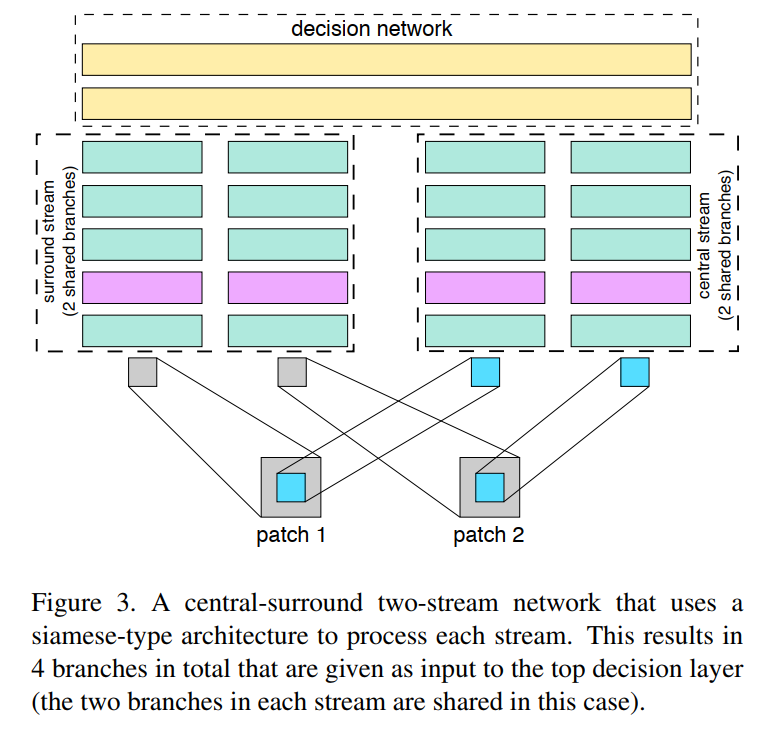
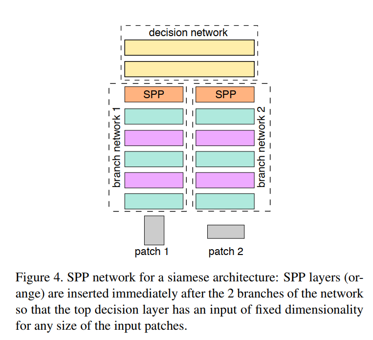

# Learning to Compare Image Patches via Convolutional Neural Networks

## 1.Introduction

介绍一种不依赖手工设计特征，而是由神经网络学习实现立体匹配的方法。不断尝试改进网络结构，得到了很好的效果。

## 2.Related work

已有的方法只解决small baseline stereo problem，这篇文章力求解决更广泛的外观变化问题。

## 3. Architectures

输入为任意大小任意通道数量的匹配块，但是为了与之前的算法结果比较，这里大多采用了64x64x1大小的灰度图。

3.1介绍三种基本的网络结构2-channel, Siamese, Pseudo-siamese，他们在速度与准确度上分别进行了权衡。3.2介绍一些模型优化的策略。

#### 3.1 Basic models

###### 3.1.1 Siamese

两个分支共享权重，不断进行卷积、ReLU、池化，最后拼接为一个全连接层。分支可看作特征的提取，顶层的全连接层可视为相似性的计算。

###### 3.1.2 Pseudo-siamese

比起Siamese，它在分支上不共享权重。

###### 3.1.3 2-channel

不分两个分支了，直接把两个灰度图叠加到一起，作为一个双通道的图像输入。这样的话在训练的时候会非常快，但是测试的时候会慢一些。

#### 3.2 Additional models

1.深层网络，大卷积核拆成小卷积核，加深网络深度，由一个4x4卷积层，和6个3x3卷积层组成。

2.如下图所示，一边是从64x64的块中截取一个32x32的匹配块训练，另一边是降采样到32x32，这样多尺度的分辨率有利于提高效果；并且中心像素部分进行了两次操作，也就是说我们相比较于边缘部分更关注中心部分，这也有利于提高匹配精度；大小变小也使训练速度更快。

3.独立于匹配模块的SPP结构，可以把不同大小的经过组合变为固定大小的决策层输入。

## 4.Learning

1. 强监督方式。采用铰链损失函数，l2范式正则化。采用ASGD进行梯度下降：持续的学习率1.0，动量0.9，权重衰减0.0005。mini-batches大小为128。
2. 数据集处理：不同角度翻转图片减小过拟合。

## 5.Experiments

2-channel效果很好，多尺度分辨率信息对提高匹配精度有很大作用。
