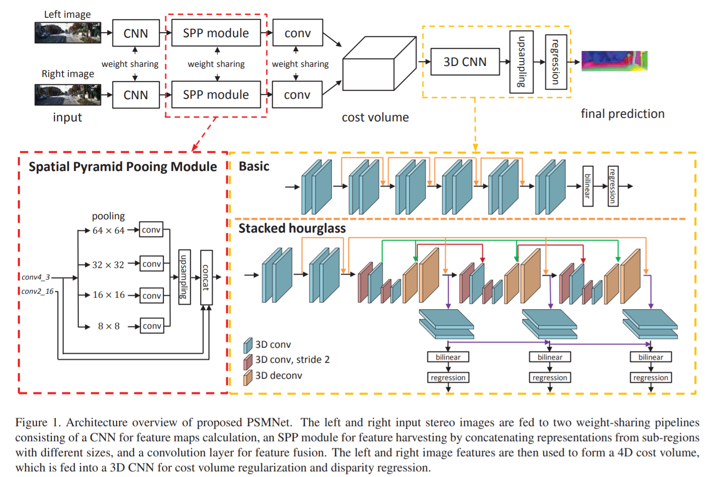
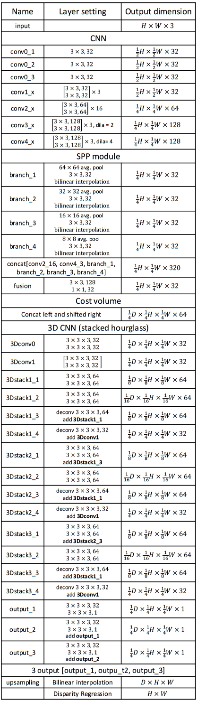

# Pyramid Stereo Matching Network

## Abstract

充分利用不同尺度下的上下文信息生成代价空间，解决一些illposed regions问题。

## 1.Introduction

为处理遮挡区域、重复纹理、无纹理区域，反光平面处的匹配问题，需要结合尽可能多的上下文信息。PSMNet利用空间金字塔结构以及扩张卷积，在更大的感受野范围内收集信息，以达到更好的匹配效果。

## 2.Related Work

传统的立体匹配有代价计算、代价聚合、视差计算、视差优化与后处理几步，有的研究是构建神经网络来实现其中的一步或几步。后来逐渐发展到通过端到端的网络就可以生成视差图。本文采用的金字塔结构，扩大感受野，在多尺度上提取特，利用全局的上下文信息进行优化。

## 3.Pyramid Stereo Matching Network

总体的结构是由一个SPP模块以及一个用于代价空间正则化的堆叠的沙漏模块构成的。

#### 3.1 Network Architecture

第一层使用三层3x3的卷积核构建，与之前的研究使用的7x7的卷积核相比，感受野相同，但是网络更深。conv1_x-conv4_x是用来提取unary feature的基本残差块。对于conv3_x和covn4_x采用了膨胀卷积核进一步提高感受野。

#### 3.2 Spatial Pyramid Pooling Module

综合不同尺度的特征信息对于最后的匹配效果影响是很大的，SPP模块学习不同尺度下的特征关系，如一个汽车与他的构成部分（车窗，车轮等）的关系。PSMNet中使用了4个尺度下的平均池化层，并进一步做了1x1的卷积与上采样。

#### 3.3 Cost Volume

四个维度的代价空间，高度x宽度x视差x特征值。

#### 3.4 3D CNN

###### 第一种：basic architecture

12个3x3x3的卷积层构成。通过bilinear interpolation上采样到HxWxD，最后用回归的方法得到最终的视差图。

###### 第二种 ：stacked hourglass

由三个沙漏网络组成，也就是说有三个输出和损失函数值。训练阶段最终损失函数值是三个的加权和，在测试阶段损失函数值为最后一个。

#### 3.5 Disparity Regression

每个视差d概率是由预测的代价$c_{d}$经过softmax函数$\sigma()$计算出的。预测的视差$\hat {d}$由如下公式获得：

#### 3.6 Loss

