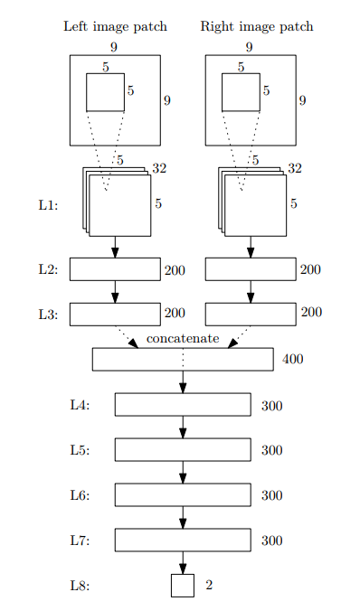

# Stereo Processing by SemiglobalMatching and Mutual Information

## Abstract

一种半全局的匹配方法，使用mutual information作为匹配代价。全局的方法一般有个平滑项的约束，SGM从各个方向使用路径优化。另外还有一些后处理，这个算法在当时的精度是很高的，而且运行时间也比较短，在一般测试用的图片上需要1-2秒。

## 1.INTRODUCTION

很多情境中都需要双目重建的技术。现在有两个方面比较重要：一是解决一些难以准确匹配的问题，如：遮挡、重复纹理、光照因素、弱纹理区域等；二是很多场景下会要求实时的重建或者近似实时的重建，速度也是需要考虑的一个方面。

根据Scharstein和Szeliski的调查，大多数的双目立体匹配的方法有四个步骤：代价计算、代价聚合、视差估计与优化、视差修正。

1.代价计算：以前的一些SD，SAD啥的对光照强度比较敏感，这篇文章以MI为代价。

2.代价聚合，是指这个像素点的最终代价值不知是由他自己决定的，还结合了他的邻域内的信息。

3.视差计算：local algorithms中采用winner takes all的策略，选取最小视差。global algorithms一般无代价聚合的步骤，而是定义一个全局的能量函数，其中的平滑项的设置，寻找使全局能量函数最小的策略都不尽相同。全局的算法效果很好但是太慢了，有很高的时间复杂度。

## 2.Semiglobal Matching

### 2.1 Pixelwise Matching Cost Calculation

本文使用互信息（Mutual Information，MI）来度量计算匹配代价。挖坑到时候再填吧，没看懂。最后的结果是得到一个三维的代价空间，三个方向分别代表长、宽、视差。

### 2.2 Cost Aggregation

因为容易受到噪声影响，最小的代价并不一定就是正确的结果。这里采用的方法是加了个平滑项进行约束，这个平滑项会惩罚相邻的视差变化。定义能量函数：

公式的第一项是数据项，表示当视差图为D时，所有像素的匹配代价的累加，第二项和第三项是平滑项目，惩罚那些像素p邻域$N_{P}$内的所有像素q，其中第二项是惩罚那些视差差距为1的，力度比较小；第三项惩罚那些视差大于1的，力度比较大($P_{2}$比较大)。

去最小化上面的能量函数是一个NPC问题，去找他的解的话需要大量的算力和时间。文中给出了一种路径聚合的方法，去算某一个像素p周围的一维路径的聚合代价，最后再把各个路径的的结果加起来得到最终带价值。像素p沿着某条路径r的路径代价计算公式为：

第三项把L的值限定在一个范围内：$L\leq C_{max}+P_{2}$。

### 2.3 Disparity Computation

1.拟合二次曲线找一个更精确的视差值：

2.进行左右一致性检查。

### 2.4 Multibaseline Matching

略了

### 2.5 Disparity Refinement

#### 2.5.1 Removal of Peaks

去除小的连通域，用区域生长的算法，从一个像素点开始找他的4方向或者8方向的同属一个连通域的点，这里需要一个阈值N1，当两个像素点的视差值小于N1时认为他们同属一个连通域。获得一块连通域后，统计它所含像素点的数量，若小于阈值N2则认为它是噪声，把它的视差值设为无效。

#### 2.5.2 Intensity Consistent Disparity Selection

解决弱纹理区域的问题，比如前景是一个物体背景是一面白墙。首先提出了三个假设：

1. 弱纹理的区域视差是连续的。
2. 弱纹理不是无纹理，多少还是有一点纹理的。
3. 弱纹理区域的表面可近似用一个平面代替。

使用Mean Shift Segmentation[论文链接](http://citeseerx.ist.psu.edu/viewdoc/download?doi=10.1.1.76.8968&rep=rep1&type=pdf)来确定哪些区域是弱纹理区域。需要处理的弱纹理区域标记为$S_{i}$,每一块弱纹理区域中又有因为一些纹理产生的视差，生成的视差块(大小要大于12个像素)，标记为$S_{ik}$。不同的$S_{ik}$可拟合出不同的平面$F_{ik}$。

现在的问题是找到一个最优的平面，根据$F_{ik}$拟合的平面计算块$S_{i}$的能量值$E_{ik}$,公式跟前面一样：

能量值最小的平面则是最优拟合平面，用这个平面来代替这块弱纹理的区域就可以了。

#### 2.5.3 Discontinuity Preserving Interpolation

视差无效的区域分为：第一种是遮挡区，即由于前景遮挡在左视图上可以看到但是在右视图上不可看到的区域；第二种是误匹配区，即处在非遮挡区域但是也匹配错误的区域。

对于遮挡区插值的策略是用背景的有效视差填充，可以在水平方向上找第一个最小的值（离得远的视差越小）。

对于误匹配区域适合用周围的视差进行填充。

最后用中值滤波平滑一下。
