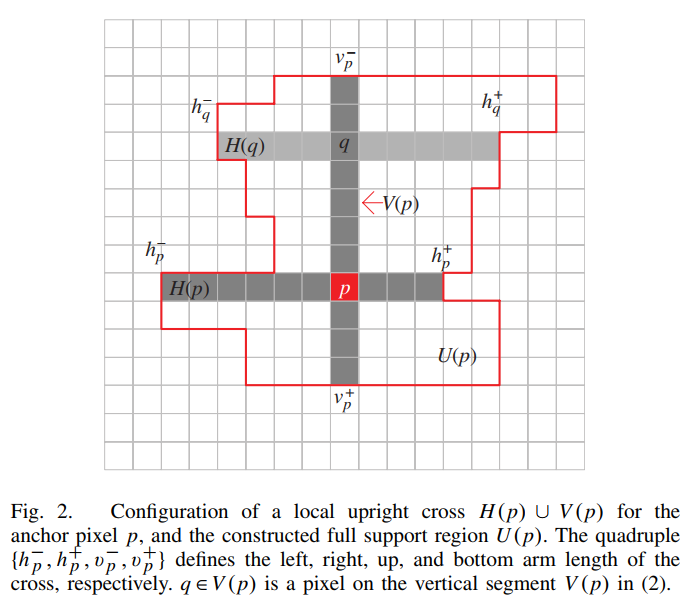
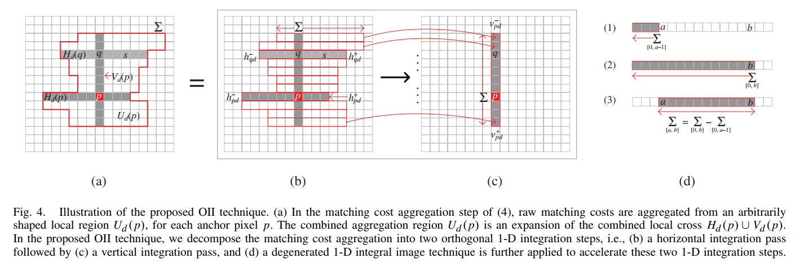

# Cross-Based Local Stereo Matching Using Orthogonal Integral Images

## 1.Introduction

局部匹配的方法比起全局或者半全局的方法来说，参数少、方便、快，但是之前的算法都是指定一个固定大小的滑窗。我们应该确保选定区域内的视差是连续的比较好，基于这点之前的研究提出了一些方法，他们可以分为两类：

1. 在预定义的窗口中进行最优窗口的选择，或对局部窗口的大小进行像素级别的调整。但是刚性多边形很难灵活的满足各种场景需要，自适应多边形在代价聚合上效率低下。
2. 第二种是给定的窗口是固定的，但是会调整给每个像素的权重值。

## 2.CROSS-BASED LOCAL STEREO MATCHING

### 2.1Cross-Based Local Support Region Construction

构造这个区域的方法还是挺简单的，选定一个像素p，向它的四方向延申，作为它的四臂。这个臂要尽量的长，当有个像素的颜色与p的颜色差异过大就要停了，这里需要设定一个阈值；还有就是臂长也是有限度的，这也需要个阈值。

对于某个像素只需要保存他的四臂信息就行了，节省了存储空间。

由四臂可得到最后的区域，这个最后的区域是垂直臂V(p)上所有像素（如q）的水平臂H(q)之和。

### 2.2Locally Adaptive Matching Cost Aggregation

假设p和p'分别是左右两幅图中的对应点，其在各自所在图中形成的完整支持区域U(p)和U'(p')很可能大小形状是不同的。这里要组合两个局部聚合区域，取二者重叠的区域，并对其进行归一化计算：

其中$U_{d}(p)$是二者重叠区域像素点的集合。

两步进行聚合：

1. 对每个水平臂，把他们的的代价值相加储存在垂直臂V(p)相应的位置。
