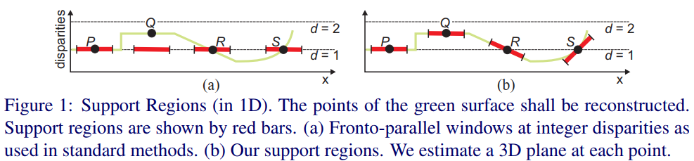

# PatchMatch Stereo - Stereo Matching with Slanted Support Windows

## 1 Introduction

一般的立体匹配算法，都是以木匾像素点p为中心，做一个匹配区域，然后去另一目的图片中搜索颜色差异最小的点作为匹配的点。这种方法有地方作恶错误的假设，那就是它假设匹配区域的视差连续的，但事实的情况并不是这样的（1）窗口范围内可能同时有前景背景不同的平面（2）一个平面的话，也可能是倾斜的而不是水平的。

有几篇论文使用自适应权重的方法来解决问题（1）效果还可以，这篇文章主要是来接解决问题（2）.

如上图a所示绿色的线是平面的一维表示，对于P点可以找到准确的视差，但是对于Q（亚像素sub-pixel disparity）,R（倾斜平面），S（倾斜曲面）等情况，是得不到准确的视差的。本文的算法是计算出一个3D平面如上图b，这样的作法会找到更为精确的视差值。

## 2 Algorithm

### 2.1 Model
